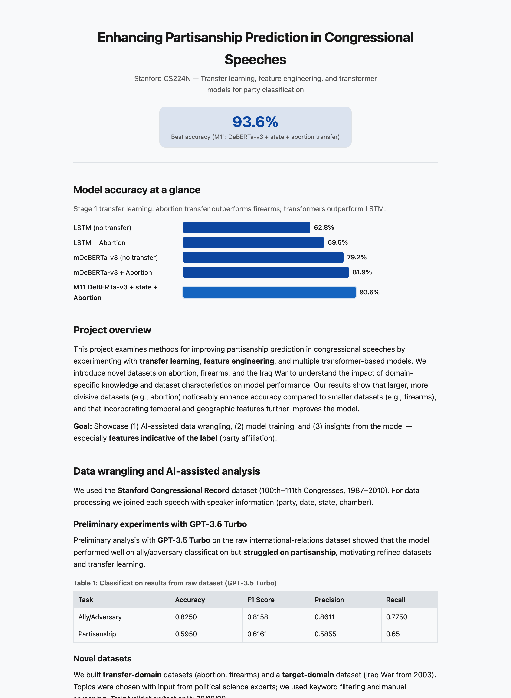

# Enhancing Partisanship Prediction in Congressional Speeches

**Can distant-domain transfer learning teach a model to tell a Democrat from a Republican by how they talk? Yes — pretraining a transformer on a *divisive* topic (abortion) and adding geographic context lifts party-classification accuracy on out-of-domain Iraq-War speeches from a 62.8% LSTM baseline to 93.6%.** A Stanford CS224N final project on transfer learning, feature engineering, and transformer models for political-text classification.

**[▶ Live results site →](https://sherryyyyang.github.io/cs_224n/demo/index.html)**



## Headline result

Evaluation is on a held-out **Iraq-War speeches** test set (target domain); models are pretrained on a *transfer* domain, then fine-tuned on Iraq.

| Model | Transfer domain | Features | Accuracy |
|---|---|---|---|
| Bidirectional LSTM (baseline) | — | — | 62.8% |
| Bidirectional LSTM | Abortion | — | 69.6% |
| mDeBERTa-v3 | — | — | 79.2% |
| mDeBERTa-v3 | Abortion | — | 81.9% |
| DeBERTa-v3 | — | year + state | 92.7% |
| **DeBERTa-v3 (M11, best)** | **Abortion** | **state** | **93.6%** |

**What moved the needle**
- **Transformers ≫ LSTM** — even without transfer, mDeBERTa-v3 beats the tuned LSTM by ~16 points.
- **Divisive > small transfer domains** — abortion (larger, more polarizing) transfers better than firearms, which sometimes *hurt* accuracy.
- **Context features help** — prepending `year {year}` and `state {state}` to the speech text (temporal + geographic signal) adds several points; state is the single most useful add-on.
- **Prompted GPT-3.5 Turbo struggled on partisanship** (59.5% vs 82.5% on ally/adversary) — motivating the fine-tuned, transfer-learning approach.

## Approach

- **Data:** Stanford Congressional Record (100th–111th Congresses, 1987–2010), each speech joined to speaker party, date, state, and chamber. Purpose-built **abortion** and **firearms** transfer datasets and an **Iraq-War** target dataset (topics chosen with political-science input; keyword filtering + manual screening), split 70/10/20 (~22.5k speeches).
- **Models:** bidirectional LSTM baseline; transformer models mDeBERTa-v3, DeBERTa-v3, and RoBERTa, fine-tuned with **LoRA** for efficiency.
- **Pipeline:** pretrain on a transfer domain → fine-tune on Iraq → evaluate on the Iraq test set.

## Repository structure

| Path | Contents |
|---|---|
| `Code/Model/LSTM_Baseline/` | Bidirectional LSTM notebook + trained `.h5` weights and the party embedding matrix |
| `Code/Model/deBERTa.ipynb` · `BERT.ipynb` · `Llama.ipynb` | Transformer model training / fine-tuning notebooks |
| `Code/Model/Copy of CS 224S GPT Model.ipynb` | Preliminary GPT-3.5 Turbo experiments |
| `Code/Notebooks/IterativeAnalysis.ipynb` | Analysis of features most indicative of party |
| `Evaluation/` | `dataset_processing.ipynb`, `Evaluation.ipynb`, and the processed Iraq target-domain speeches (`data_*.csv`) + labels (`label_*.csv`), 2003–2010 |
| `demo/` | The static results website (GitHub Pages) |

## Reproducing

The notebooks were built for GPU (Colab / Stanford compute).

```bash
pip install -r requirements.txt
jupyter lab   # or open the notebooks in Colab
```

- Start with `Evaluation/dataset_processing.ipynb` (data prep), then the model notebooks under `Code/Model/`, then `Evaluation/Evaluation.ipynb`.
- The processed **Iraq target-domain** CSVs are included so the evaluation is runnable; the full raw Congressional Record and intermediate corpora are not redistributed (`Raw_data/`, `Processed_data/` are gitignored).
- The GPT-3.5 Turbo notebook needs `OPENAI_API_KEY` in the environment.

The full write-up and poster (`CS224N_Spring_2024__Project_Final_Report.pdf`, `CS_224N_Poster.pdf`) are showcased via the live site rather than committed.

## License

MIT — see [`LICENSE`](LICENSE).
